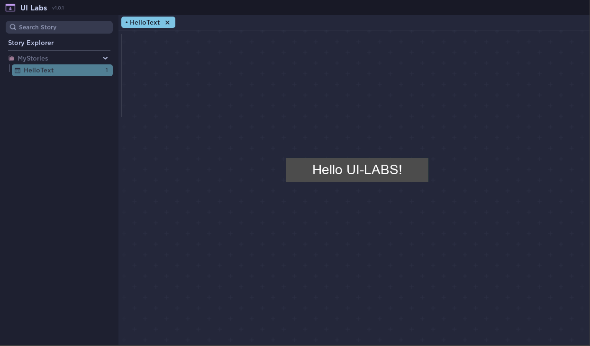
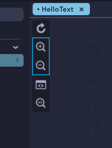
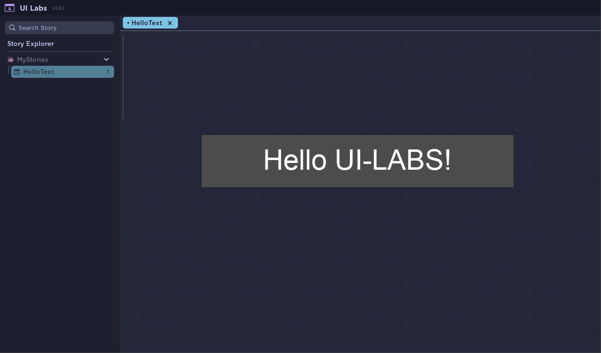
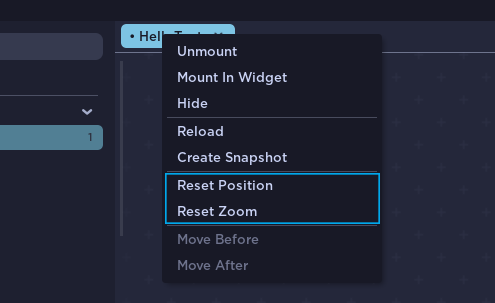

# Visualizing your Story

We have our text here!
but it's not centered and it's too small so lets fix that.

## Moving your view

You can move your canvas by holding middle mouse and dragging the view.

Great!, but now it's too small so, what can we do about it?.

---

## Zooming In-Out

You can zoom in and out with the magnifying glasses at the side toolbar. Make your text bigger by clicking them.

You can also hold **Shift** and move the scroll wheel up/down to zoom without using the buttons.

Nice! now we can see our text nicely.

---

## Resetting Padding / Zooming

You can reset both the Zoom and Padding by right clicking your story preview and selecting **Reset Position/Zoom**

:::caution Scaling Different Interfaces
UI Labs uses [UIScale](https://create.roblox.com/docs/reference/engine/classes/UIScale) to zoom in/out. Depending on your setup and/or Roblox limitations, zooming might give unexpected results.
:::
