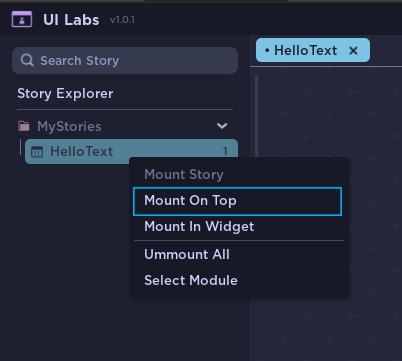
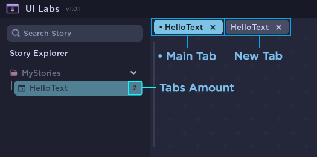

# Multi-Mounting

UI Labs lets you to preview multiple stories simultaneously even of the same story module, allowing you to create quick drafts with your components, or compare multiple UI's.    
Each of these story's previews will have their own isolated enviroment and will update when changed individually.  

To do this, right click your story and select **Mount On Top**

When you left-click your story as you've been doing all of this time, this will be mounted in the **Main** tab and it
will unmount the current Main tab.  

The Main tab can be recognized with a dot at the start, however, all tabs will be shown here.  
The amount of preview tabs mounted for this story can be seen at the story Right-Corner

The Toolbar buttons, moving, zooming, and Controls will be applied to the story preview you are currently selecting
