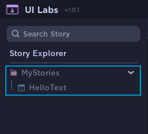
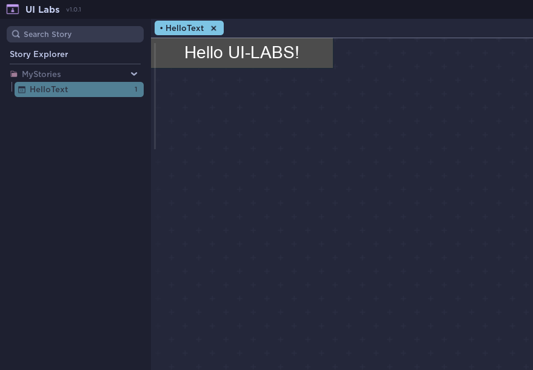

# Finding your Story

At this point, you should've made your first story. Let's learn how to use UI Labs

On start, UI Labs will search in all your game tree to find any module with **`.story`** at the end of the name.  
If you havent created any [Storybook](../storybook.mdx) you will find all of your stories grayed out.

We'll talk about **Storybooks** later. For now, open the story you just created

Click the story to start visualizing it. This will open a new **Preview Tab**

