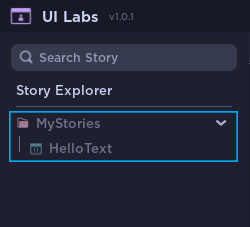

# Finding your Story

At this point, you should've made your first Story. Let's learn how to use UI-Labs

On start, UI-Labs will search in all your game tree to find any module with **```.story```** at the end of the name.<br></br>
If you havent created any (link)Storybook(link) you will find all of your stories grayed out and labeled as *"Unknown"*. 



We'll talk about **Storybooks** later. For now we will open the Story we just created

Click the story to Start visualizing it with UI-Labs


:::tip Opening your story
   You can click the path after your Story name to open your Story module
:::