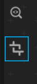

# Extra Tools

UI-Labs also Provides some tools when visualizing your Interface.

Currently, UI-Labs only has the **Measure tool** so, let's learn how to use it

## Measure tool

The measure tool can help us to check the size of a Portion of your UI while you are visualizing it

Click the Measure tool to activate it



Once activated, you can click and drag to measure a Portion of your UI. Let's measure our Text


Now we can know that our text frame has a size of 300x50 pixels, so if we return to our [Story script](../Stories/function.md#using-roact) we can see that it is accurate

import Tabs from '@theme/Tabs';
import TabItem from '@theme/TabItem';

<Tabs>
   <TabItem value="lua" label="Luau">

   ```lua {11}
      --HelloText.story.lua
      local ReplicatedStorage = game:GetService("ReplicatedStorage")
      local Roact = require(ReplicatedStorage.Roact)

      return function (target: Frame)
         local element = Roact.createElement("TextLabel", {
            Text = "Hello UI-LABS!",
            TextColor3 = Color3.new(1,1,1),
            BackgroundColor3 = Color3.new(0.3, 0.3, 0.3),
            TextSize = 20,
            Size = UDim2.fromOffset(300, 50),
         })
         local handle = Roact.mount(element, target) --We mount inside target

         --We need to return another function to unmount the handle
         return function()
            Roact.unmount(handle)
         end
      end
   ```

   </TabItem>
   <TabItem value="ts" label="Roblox-TS">

   ```ts
      //HelloText.story.ts
      import Roact from "@rbxts/roact";

      export = (target: Frame) => {
         const element = Roact.createElement("TextLabel", {
            Text: "Hello UI-LABS!",
            TextColor3: new Color3(1, 1, 1),
            BackgroundColor3: new Color3(0.3, 0.3, 0.3),
            TextSize: 20,
            // highlight-next-line
            Size: UDim2.fromOffset(300, 50),
         });
         const handle = Roact.mount(element, target); //We mount inside target

         //We need to return another function to unmount the handle
         return () => {
            Roact.unmount(handle);
         };
      };

   ```

   </TabItem>
</Tabs>


This size is not affected by zoom