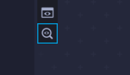
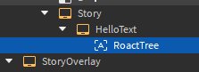
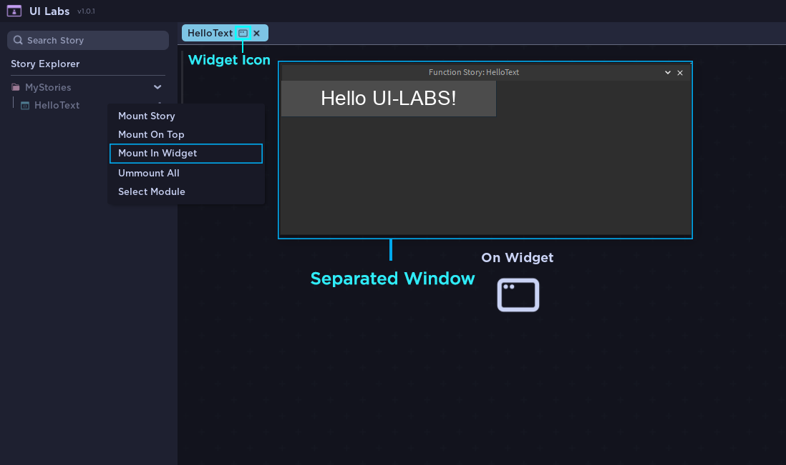
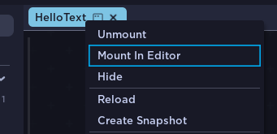
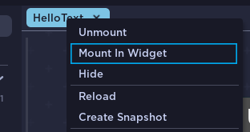
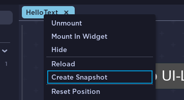

# Extra Features

Addionally, let's view some other useful features/options that UI Labs has.

---

### View On Explorer

You can view the Instances tree of your story by pressing "View On Explorer".   _It's not recommended to change these instances_

 

---

### Mounting in Widget

You can use a separated widget window for your stories. This enables fullscreen mode, distraction-free GUIs, plugin-like visualization, and multi-monitor setups. Right click your story and choose **Mount In Widget**

You can switch between **Widget/Editor** mode by clicking your story preview and selecting **Mount In Editor/Mount In Widget**

 

---

### Hiding Stories

You can hide stories when you have multiple of them mounted. This disables the `Visible` property.
For this you can right click your story and choose **Hide**. You can show it again by clicking **Un-Hide**

 

---

### Creating Snapshots

You can create a snapshot of the current state of your story. This clones all instances of your story and adds them in a separated `ScreenGui` inside `StarterGui`.  

Keep in mind that this only clones the instances, so no code will be running here

 
