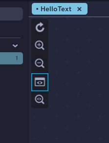

# Using the Game Viewport

Sometimes you want to visualize your UI in the Game Viewport to see how this will look in the final game. We can do this by clicking the **View On Viewport** button.

Once clicked, you will see your UI in the game viewport. This will hide the UI in the UI Labs editor view. Click it again to bring it back.  

Keep in mind that because this is how your UI will look in the final game, **no zooming or moving will be reflected here**.

