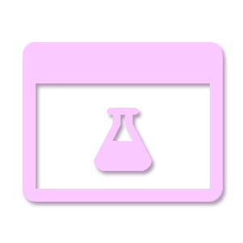

# Introduction

When working with **Declarative UI Libraries** like **[Roact](https://roblox.github.io/roact/)** or **[Fusion](https://elttob.uk/Fusion/0.2/)**, creating User Interfaces with code becomes challenging when you try to preview your UI. UI-Labs aims to solve this problem:

UI-Labs is a **Storybook** plugin for roblox. This plugin allows you to visualize UI components in a _sandboxed_ environment, enabling you to isolate sections of your interface for individual testing.

## Installing UI-Labs

To install UI-Labs, visit its Plugin's [Roblox Page](https://www.roblox.com/discover#/) for a price of **150 Robux**. Once you obtain the plugin, you can press "Install" to get the latest version.

:::caution Note
UI Labs will become **Open Source** in the future.
:::

:::info Roblox-TS Support
UI-Labs was completly written with **Roblox-TS**, therefore UI-Labs provides full support for it. You can find **Types** and **Utility functions** for UI-Labs installing this [Package](https://www.npmjs.com/package/@rbxts/ui-labs) from NPM.

Any example code provided here will have **Luau** and **Typescript** examples
:::
