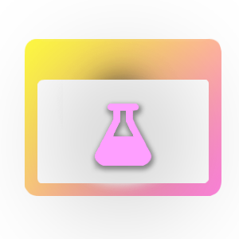
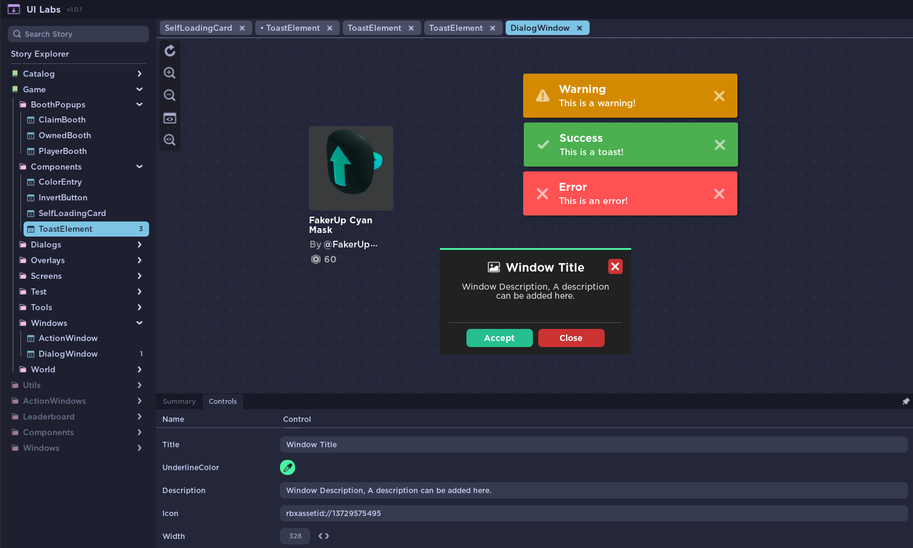

# Introduction

When working with **Declarative UI Libraries** like **[Roact](https://roblox.github.io/roact/)** or **[Fusion](https://elttob.uk/Fusion/0.2/)**, creating User Interfaces with code becomes challenging when you try to preview them. UI Labs aims to solve this problem:

UI Labs is a **Storybook** plugin for roblox. This plugin allows you to visualize UI components in a _sandboxed_ environment, enabling you to isolate sections of your interface for individual testing.

## Installing UI Labs

You can find the latest version of UI Labs in its roblox [Plugin Page](https://create.roblox.com/store/asset/14293316215/UI-Labs) or open sourced in [Github](https://github.com/PepeElToro41/ui-labs)

## Using the Utilities package

UI Labs can be used with no extra code, but it requires the Utils package to unlock its full potential.

-  If you are using Roblox-TS, you must use the [NPM Package](https://www.npmjs.com/package/@rbxts/ui-labs)
-  If you are using LUAU, you can go to the repository [Releases](https://github.com/PepeElToro41/ui-labs-utils/releases)

:::info Wally Package
Wally package for UI-Labs is planned
